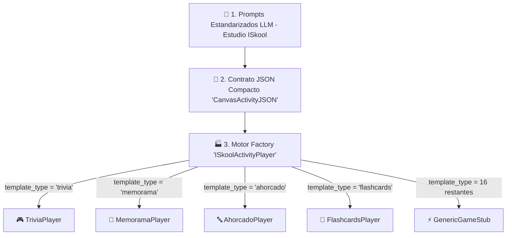

# Patrón Factory de Actividades e Integración de 20 Plantillas (`ISkool_Game_Factory_Pattern.md`)

## 1. Misión y Justificación de Arquitectura
Para escalar la plataforma educacional a decenas de minijuegos gamificados sin incrementar los costos de desarrollo ni recalibrar los prompts del Modelo de Lenguaje (LLM), el **Estudio ISkool** adopta el **Patrón de Diseño Factory** (Fábrica Abstracta de Minijuegos).

Un único contrato JSON estándar (`CanvasActivityJSON`) generado a bajo costo alimenta indistintamente cualquier plantilla visual.



---

## 2. Ventajas del Patrón Factory para 100+ Juegos

| Dimensión | Enfoque Tradicional | Enfoque ISkool Factory |
| :--- | :--- | :--- |
| **Gasto de Tokens IA** | Se requiere 1 prompt especializado por juego. | **1 solo prompt ultracompacto** alimenta N juegos. |
| **Esquema de BD** | Tablas específicas por cada tipo de juego. | **0 cambios en BD** (Uso de `content_json` en `community_activities`). |
| **Mantenibilidad** | Fragilidad en frontend por esquemas dispares. | Decoupling total: La vista decide cómo interpretar el JSON. |
| **Escalabilidad** | Agregar un juego requiere semanas de backend. | Agregar un juego consiste únicamente en agregar 1 componente en `src/components/games/`. |

---

## 3. Registro Oficial de las 20 Plantillas Educativas

El catálogo registrado en `src/types/index.ts` bajo la constante `ISKOOL_TEMPLATES` incluye:

1. **Trivia de Preguntas** (`trivia`): Cuestionario interactivo con estrellas y feedback instantáneo.
2. **Memorama Visual** (`memorama`): Emparejamiento de tarjetas con preguntas, respuestas e imágenes.
3. **Ahorcado Educativo** (`ahorcado`): Adivinanza de palabras clave mediante pistas pedagógicas.
4. **Flashcards Animadas** (`flashcards`): Tarjetas didácticas con giro 3D e indicador de dominio.
5. **Emparejamiento (Match)** (`match`): Conexión táctil entre conceptos y definiciones.
6. **Ruleta de Conceptos** (`ruleta`): Ruleta aleatoria para dinamizar la participación en el aula.
7. **Carrera Matemática** (`carrera_math`): Desafío de agilidad y cálculo mental a máxima velocidad.
8. **Verdadero / Falso Explosivo** (`tf_explosivo`): Decisión rápida bajo presión de tiempo.
9. **Constructor de Oraciones** (`sentence_builder`): Reordenamiento sintáctico de términos clave.
10. **Escape Room Lógico** (`escape_room`): Desbloqueo de puertas resolviendo acertijos técnicos.
11. **Simón Dice Educativo** (`simon_says`): Memorización y repetición de secuencias conceptuales.
12. **Batalla de Respuestas** (`batalla_respuestas`): Competencia multijugador contrarreloj.
13. **Ordenamiento Cronológico** (`ordenamiento`): Organización secuencial de hechos históricos o procesos.
14. **Crucigrama de Saberes** (`crucigrama`): Resolución cruzada de términos de la asignatura.
15. **Rompecabezas Guiado** (`rompecabezas`): Descubrimiento visual progresivo al responder reactivos.
16. **Detectives de Palabras** (`word_detective`): Auditoría sintáctica y detección de errores en textos.
17. **Sopa de Letras** (`sopa_letras`): Búsqueda de vocabulario en cuadrículas interactiva.
18. **Mapa Interactivo** (`mapa_interactivo`): Localización de diagramas y esquemas geográficos/técnicos.
19. **Caza-Tesoros** (`treasure_hunt`): Exploración de pistas escondidas en el mapa virtual.
20. **Desafío de Clasificación** (`clasificacion`): Agrupamiento en campos formativos NEM.

---

## 4. Implementación del Componente Factory (`ISkoolActivityPlayer.tsx`)

```tsx
export const ISkoolActivityPlayer: React.FC<ISkoolActivityPlayerProps> = ({
  activity,
  templateType = 'trivia',
  onClose,
  onComplete
}) => {
  switch (templateType.toLowerCase()) {
    case 'trivia':
      return <TriviaPlayer activity={activity} onClose={onClose} onComplete={onComplete} />;
    case 'memorama':
      return <MemoramaPlayer activity={activity} onClose={onClose} onComplete={onComplete} />;
    case 'ahorcado':
      return <AhorcadoPlayer activity={activity} onClose={onClose} onComplete={onComplete} />;
    case 'flashcards':
      return <FlashcardsPlayer activity={activity} onClose={onClose} onComplete={onComplete} />;
    default:
      return <GenericGameStub activity={activity} templateType={templateType} onClose={onClose} />;
  }
};
```
