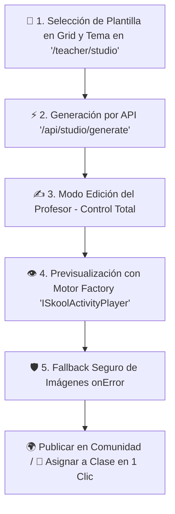

# Arquitectura Oficial del Estudio ISkool e Interfaces `StudioActivityJSON` (`ISkool_Studio_Architecture.md`)

## 1. Purga Total de Marcas e Interfaces Estandarizadas
De acuerdo con las **Reglas Corporativas de ISkool**, se completó la purga total de la base de código y se estandarizaron los tipos principales en `src/types/index.ts`:

- **Interfaces Oficiales:** `StudioActivityJSON` y `StudioActivityQuestion`.
- **Ruta Frontend Oficial:** `http://localhost:3000/teacher/studio` (`src/app/teacher/studio/page.tsx`).
- **Endpoint API Oficial:** `/api/studio/generate` (`src/app/api/studio/generate/route.ts`).
- **Componentes Refactorizados:** `StudioTriviaPlayer.tsx`, `AdminCarouselStudio.tsx`, `DataDrivenCombatView.tsx`, `PixiCombatView.tsx`.

```typescript
export interface StudioActivityQuestion {
  question: string;
  options: string[];
  correctIndex: number; // 0-3
  imageUrl?: string; // Referencia visual pedagógica
}

export interface StudioActivityJSON {
  title: string;
  description: string;
  questions: StudioActivityQuestion[];
}
```

---

## 2. Protección contra Alucinaciones de Imágenes (Fallbacks)

Para prevenir errores visuales (404) o URLs alucinadas por modelos de lenguaje, todos los reproductores de minijuegos (`StudioTriviaPlayer`, `MemoramaPlayer`, `FlashcardsPlayer`) implementan una función defensiva `onError`:

```tsx
 { e.currentTarget.src = '/images/students/default.png'; }}
  className="..."
/>
```

Si la URL especificada en el JSON falla o no responde, la interfaz conmuta instantáneamente al activo seguro local `'/images/students/default.png'` sin romper la experiencia del alumno o docente.

---

## 3. Flujo Ecosistémico en el Estudio ISkool


