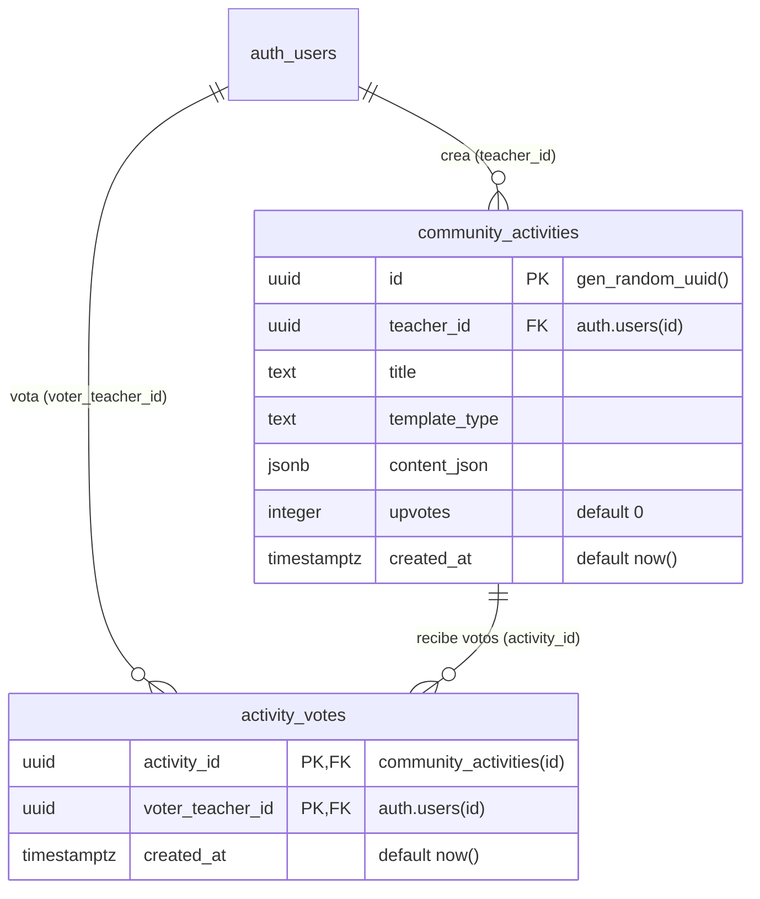

# Esquema de Comunidad Docente e ISkool Lienzo Digital (`schema_community.md`)

Este documento especifica la infraestructura de base de datos diseñada para la función **"ISkool Lienzo Digital y Comunidad Docente"**, la cual permite a los profesores compartir, explorar y votar por actividades educativas interactivas creadas directamente en la plataforma o mediante inteligencia artificial.

---

## 1. Diagrama Entidad-Relación (ER)



---

## 2. Definición de Tablas

### 2.1. `public.community_activities`
Almacena las plantillas y actividades compartidas por los docentes en la comunidad.

| Columna | Tipo | Restricciones | Descripción |
| :--- | :--- | :--- | :--- |
| `id` | `UUID` | `PRIMARY KEY`, `DEFAULT gen_random_uuid()` | Identificador único de la actividad. |
| `teacher_id` | `UUID` | `NOT NULL`, `REFERENCES auth.users(id)` | ID del profesor autor. |
| `title` | `TEXT` | `NOT NULL` | Título representativo de la actividad. |
| `template_type` | `TEXT` | `NOT NULL` | Tipo de plantilla (ej. `'trivia'`, `'memorama'`). |
| `content_json` | `JSONB` | `NOT NULL` | Estructura JSON con la configuración y contenido. |
| `upvotes` | `INTEGER` | `NOT NULL`, `DEFAULT 0` | Contador desnormalizado de votos a favor. |
| `created_at` | `TIMESTAMPTZ` | `NOT NULL`, `DEFAULT now()` | Fecha de publicación. |

### 2.2. `public.activity_votes`
Registra los votos emitidos por la comunidad de docentes para prevenir fraudes.

| Columna | Tipo | Restricciones | Descripción |
| :--- | :--- | :--- | :--- |
| `activity_id` | `UUID` | `FK`, `REFERENCES community_activities(id)` | ID de la actividad votada. |
| `voter_teacher_id` | `UUID` | `FK`, `REFERENCES auth.users(id)` | ID del profesor votante. |
| `created_at` | `TIMESTAMPTZ` | `NOT NULL`, `DEFAULT now()` | Timestamp del voto. |

> [!IMPORTANT]
> **Mecanismo Anti-Fraude en Votación (Llave Primaria Compuesta):**
> La tabla `activity_votes` define una llave primaria compuesta por `(activity_id, voter_teacher_id)`.
> Esta restricción a nivel de motor PostgreSQL imposibilita físicamente que un usuario registre más de un voto por actividad, garantizando la integridad de las votaciones.

---

## 3. Seguridad a Nivel de Fila (RLS)

Ambas tablas tienen habilitado Row Level Security (RLS) para proteger los datos.

### Políticas en `community_activities`:
- **SELECT:** `TO authenticated USING (true)`
  *Cualquier usuario autenticado puede explorar las actividades comunitarias.*
- **INSERT:** `TO authenticated WITH CHECK (auth.uid() = teacher_id)`
  *Un profesor solo puede publicar actividades asociadas a su propio usuario.*
- **UPDATE / DELETE:** `TO authenticated USING (auth.uid() = teacher_id)`
  *Únicamente el autor de la actividad puede modificarla o eliminarla.*

### Políticas en `activity_votes`:
- **SELECT:** `TO authenticated USING (true)`
  *Acceso de lectura a los votos registrados.*
- **INSERT:** `TO authenticated WITH CHECK (auth.uid() = voter_teacher_id)`
  *Un usuario solo puede emitir un voto a su propio nombre (`auth.uid()`).*
- **DELETE:** `TO authenticated USING (auth.uid() = voter_teacher_id)`
  *Permite al usuario retirar su propio voto.*

---

## 4. Automatización con Triggers y `SECURITY DEFINER`

Para mantener actualizado el contador `upvotes` en `community_activities` sin comprometer la política RLS (que impide que docentes ajenos editen directamente la tabla de actividades), se implementó una función con privilegio `SECURITY DEFINER`:

```sql
CREATE OR REPLACE FUNCTION public.handle_activity_vote_change()
RETURNS TRIGGER
LANGUAGE plpgsql
SECURITY DEFINER
AS $$
BEGIN
    IF (TG_OP = 'INSERT') THEN
        UPDATE public.community_activities
        SET upvotes = upvotes + 1
        WHERE id = NEW.activity_id;
        RETURN NEW;
    ELSIF (TG_OP = 'DELETE') THEN
        UPDATE public.community_activities
        SET upvotes = GREATEST(0, upvotes - 1)
        WHERE id = OLD.activity_id;
        RETURN OLD;
    END IF;
    RETURN NULL;
END;
$$;

CREATE TRIGGER trigger_handle_activity_vote
AFTER INSERT OR DELETE ON public.activity_votes
FOR EACH ROW
EXECUTE FUNCTION public.handle_activity_vote_change();
```
