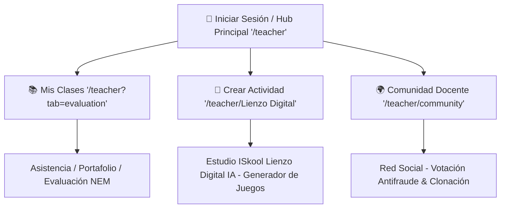

# Rediseño UX/UI: La Regla de los 3 Clics de Apple y Mapa de Rutas del Hub (`UX_Teacher_Apple_Rule.md`)

## 1. Contexto y Diagnóstico Anterior
La interfaz original del portal del profesor presentaba una alta carga cognitiva debido a la presencia simultánea de múltiples pestañas, menús anidados y filtros técnicos.

Para docentes con **baja adaptación tecnológica** o poco tiempo libre entre clases, esta estructura provocaba fricción cognitiva y retrasos.

---

## 2. Paradigma de Diseño "Apple/iOS" y Mapa de Rutas Directo

El **Hub Central del Profesor** (`/teacher`) implementa el mapa de navegación limpia de 3 tarjetas masivas en el App Router de Next.js:



---

## 3. Especificaciones de Enrutamiento de las Tarjetas Masivas

### Componente: `src/components/TeacherHubCards.tsx`

| Tarjeta | Ruta Destino (App Router) | Estética Tailwind CSS v4 | Acción (1 Clic) |
| :--- | :--- | :--- | :--- |
| **📚 Mis Clases** | `/teacher` (Pestañas de Evaluación) | `rounded-3xl`, `bg-white/90`, gradiente azul/índigo, `hover:scale-[1.02]`. | Gestiona alumnos, pase de lista y evidencias. |
| **🎨 Crear Actividad** *(Hero)* | `/teacher/Lienzo Digital` | `bg-gradient-to-b from-purple-600 via-violet-600 to-indigo-700`, `ring-4 ring-purple-500/20`, insignia animada. | Abre el estudio de creación **ISkool Lienzo Digital IA**. |
| **🌍 Comunidad Docente** | `/teacher/community` | `rounded-3xl`, `bg-white/90`, gradiente esmeralda/teal, `hover:scale-[1.02]`. | Entra a la red global de profesores. |

---

## 4. Navegación Unificada y Botón de Retorno

En cualquiera de las sub-rutas (`/teacher/Lienzo Digital` o `/teacher/community`), se integró una barra superior con el botón **`← Volver al Hub Docente`**, permitiendo regresar al centro de mando en `/teacher` con 1 solo clic.

```tsx
<button onClick={() => router.push('/teacher')} className="...">
  <ArrowLeft className="w-4 h-4 text-purple-500" />
  <span>Volver al Hub Docente</span>
</button>
```

---

## 5. Resultados e Impacto UX
- **Navegación sin ambigüedad:** Al hacer clic en la tarjeta central "🎨 Crear Actividad", Next.js enruta directamente a `/teacher/Lienzo Digital`.
- **Cero Fricción Cognitiva:** El profesor visualiza de forma limpia las 3 opciones principales sin distracciones.
- **Diseño Resiliente:** Renderizado dinámico en modo claro/oscuro con transiciones fluidas.
