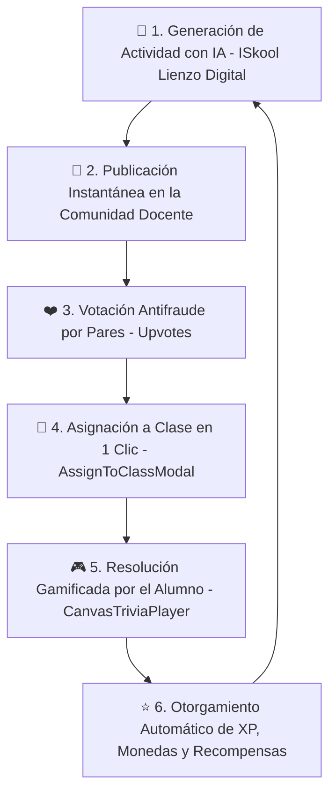

# El Ciclo de Retención Gamificado: Red Social Docente, Asignación a Clase y Reproductor Visual (`Teacher_Social_Loop.md`)

## 1. El Diagrama de Flujo Final del Ciclo Ecosistémico

La función **ISkool Lienzo Digital** conecta de forma transparente el trabajo del docente con la experiencia gamificada del estudiante, respetando la **Regla de los 3 Clics de Apple**:



### Fases del Ciclo Ecosistémico:
1. **Generación Económica por IA:** El profesor ingresa un prompt o selecciona un tema; el LLM responde únicamente con una estructura JSON hiper-compacta (`CanvasActivityJSON`), reduciendo el gasto de tokens al mínimo.
2. **Publicación en la Red Docente:** La actividad se inserta en `community_activities` en Supabase con RLS activado.
3. **Reconocimiento Social & Voto Antifraude:** Los profesores de la comunidad exploran las mejores actividades. La restricción de **Llave Primaria Compuesta** `(activity_id, voter_teacher_id)` en la tabla `activity_votes` imposibilita el voto doble.
4. **Asignación a Clase en 1 Clic (`AssignToClassModal`):** Al presionar "Asignar", se abre un modal minimalista con los grupos del docente. Al presionar `"🚀 Enviar a mis alumnos"`, el contenido se clona directamente en las misiones (`quests`) del grupo seleccionado y se despliega una notificación flotante (Toast).
5. **Resolución por el Alumno (`CanvasTriviaPlayer`):** El alumno abre el reto en su mapa de aprendizaje y lo resuelve en el reproductor interactivo.
6. **Recompensas e Impacto Gamificado:** Al finalizar, el alumno recibe XP y monedas automáticas para su avatar y el ranking escolar.

---

## 2. Componente de Asignación en 1 Clic (`AssignToClassModal.tsx`)

| Propiedad | Descripción Técnica |
| :--- | :--- |
| **Interfaz** | Modal flotante estilo Apple UI (`backdrop-blur-2xl`, `rounded-3xl`, `shadow-2xl`). |
| **Selección de Aula** | Dropdown / lista táctil de grupos activos del docente (`4º Primaria A`, `2º Secundaria A`, `1º Primaria A`, `4º Prep A`). |
| **Recompensas Personalizables** | Campos para definir la recompensa en XP (default `50`) y Monedas (default `25`). |
| **Acción Principal** | Botón gigante `"🚀 Enviar a mis alumnos"` que clona la actividad en Supabase y dispara la notificación Toast. |

---

## 3. Resiliencia y Tolerancia a Fallos (`ErrorBoundary.tsx`)

Para prevenir pantallas blancas en caso de errores en la respuesta de la IA o de la base de datos, el reproductor visual `CanvasTriviaPlayer` está envuelto en un **Error Boundary**:

```tsx
<ErrorBoundary fallbackTitle="Nuestros duendes mágicos están ocupados">
  <CanvasTriviaPlayer activity={activityJSON} />
</ErrorBoundary>
```

- Si ocurre una excepción de renderizado o JSON malformado, captura el error de forma segura y muestra un mensaje amigable al usuario con el botón `"Volver a Intentar"`.

---

## 4. Resumen de Tablas y Flujos en Supabase

- `community_activities`: Registro de plantillas globales.
- `activity_votes`: Control de votos únicos por profesor (`voter_teacher_id`).
- `quests`: Clones creados por los docentes vinculados a sus asignaciones grupales.
