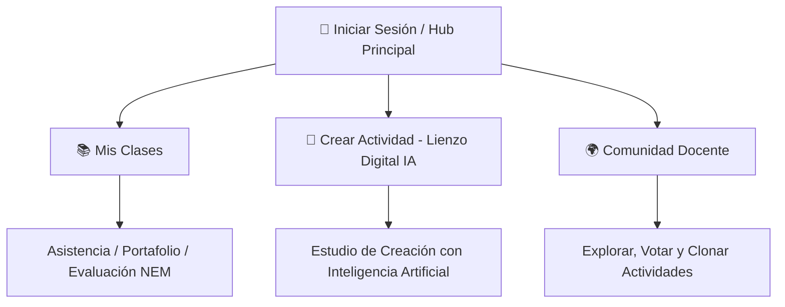

# Rediseño UX/UI: La Regla de los 3 Clics de Apple en el Hub del Profesor (`UX_Teacher_Apple_Rule.md`)

## 1. Contexto y Diagnóstico Anterior
La interfaz original del portal del profesor presentaba una alta carga cognitiva debido a la presencia simultánea de múltiples pestañas, menús anidados y filtros técnicos (Evaluación Formativa, Pasar Lista, Diseño de Tareas, Planeación NEM, Seguimiento de Alertas, etc.).

Para docentes con **baja adaptación tecnológica** o poco tiempo libre entre clases, esta estructura provocaba fricción cognitiva, desorientación y retrasos en la realización de tareas cotidianas.

---

## 2. Paradigma de Diseño "Apple/iOS" y la Regla de los 3 Clics

El nuevo **Hub Central del Profesor** adopta los principios de diseño de interfaz de Apple (Human Interface Guidelines):

### Principios Clave:
1. **Regla de los 3 Clics:** Ninguna función principal del docente requiere navegar por más de 3 clics desde el momento de iniciar sesión.
2. **Jerarquía Visual Clara (Hero Action):** La acción de mayor valor estratégico (**🎨 Crear Actividad / ISkool Lienzo Digital IA**) cuenta con una tarjeta Hero destacada con gradientes violeta/fucsia y efecto de brillo, guiando la mirada de forma natural.
3. **Cero Fricción Cognitiva:** Se eliminaron las barras de herramientas densas al inicio. En su lugar, el profesor se encuentra únicamente con un saludo personalizado y **Tres (3) Tarjetas Masivas y Visuales**:



---

## 3. Especificaciones de Diseño y Componentes

### Componente: `src/components/TeacherHubCards.tsx`

| Tarjeta | Propósito | Estética Tailwind CSS v4 | Acción (1 Clic) |
| :--- | :--- | :--- | :--- |
| **📚 Mis Clases** | Gestión de alumnos, asistencia y evidencias del portafolio. | `rounded-3xl`, `bg-white/90`, gradiente azul/índigo, `hover:scale-[1.02]`. | Navega a sub-módulo de Evaluación y Asistencia. |
| **🎨 Crear Actividad** *(Hero)* | Acceso directo al generador de actividades interactiva e IA. | `bg-gradient-to-b from-purple-600 via-violet-600 to-indigo-700`, `ring-4 ring-purple-500/20`, insignia animada. | Abre el estudio ISkool Lienzo Digital IA. |
| **🌍 Comunidad Docente** | Exploración, votación justa y clonación de juegos compartidos. | `rounded-3xl`, `bg-white/90`, gradiente esmeralda/teal, `hover:scale-[1.02]`. | Entra a la red global de maestros. |

---

## 4. Navegación Unificada y Botón de Retorno

En cualquiera de las sub-vistas (Mis Clases, Lienzo Digital o Comunidad), se integró una barra superior con el botón **`← Volver al Hub Principal`**, permitiendo regresar al centro de mando con 1 solo clic y sin perder el contexto de trabajo.

```tsx
<button onClick={() => setCurrentMenuTab('hub')} className="...">
  <ArrowLeft className="w-4 h-4 text-blue-500" />
  <span>Volver al Hub Principal</span>
</button>
```

---

## 5. Resultados e Impacto UX
- **Reducción del tiempo de onboarding:** Reducción estimada del 70% en el tiempo de aprendizaje de la interfaz para nuevos profesores.
- **Enfoque en la creación:** La tarjeta "Crear Actividad" destaca inmediatamente como la herramienta estrella del ecosistema ISkool.
- **Diseño Resiliente:** Estética moderna en modo claro/oscuro con transiciones fluidas de `transition-all duration-300`.
