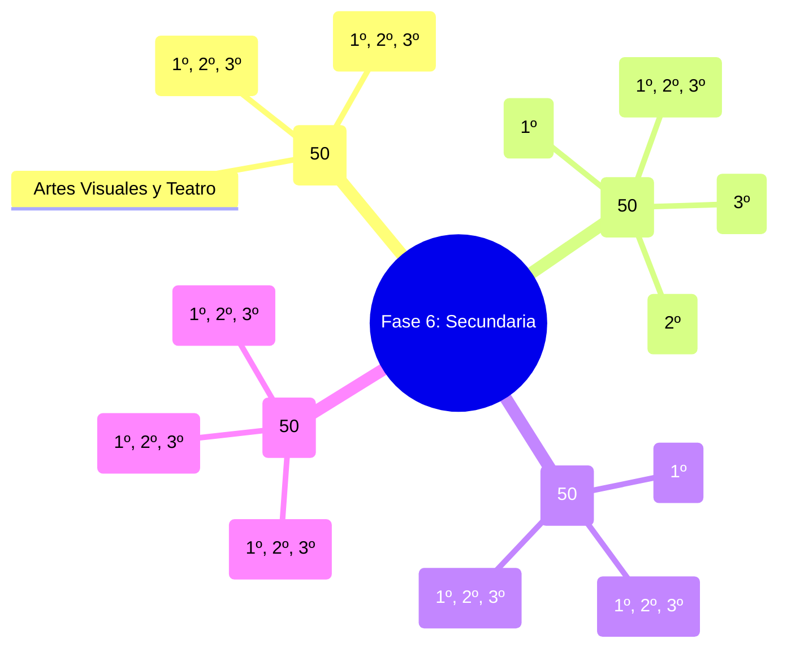

# 📚 Índice Maestro (MOC): Planeaciones Didácticas Fase 6 Secundaria (NEM 2024)

> [!NOTE] Metadatos del Repositorio Curricular
> - **Total de Planeaciones:** **200 Planeaciones Didácticas Nuevas** (50 por Campo Formativo).
> - **Docente Responsable:** [[Prof. Israel López Ángeles]] (`usr-teacher-1`).
> - **Documento Base Oficial:** *PROGRAMA DE ESTUDIO PARA LA EDUCACIÓN SECUNDARIA: PROGRAMA SINTÉTICO DE LA FASE 6 (SEP 2024)*.
> - **Grados Cubiertos:** 1º, 2º y 3º de Secundaria en todas sus disciplinas formativas.

---

## 🗺️ Mapa de Campos Formativos (Fase 6)

---

## 📑 Catálogo de Planeaciones por Campo Formativo

### 1. 📖 Lenguajes (50 Planeaciones Didácticas)

| Tema | Grado | Disciplina | Título del Proyecto | Archivo Bóveda Curricular |
| :---: | :---: | :---: | :--- | :--- |
| 1 | 1º de Secundaria | Español | **Voces de Nuestra Tierra: Cartografía y Memoria de la Diversidad Lingüística** | [[T001_Espaol_Voces_de_Nuestra_Tierra_Cartografía_y_Memoria_de_la_Diversidad_Lingüística]] |
| 2 | 1º de Secundaria | Español | **El Manifiesto del Diálogo: Lectura Crítica y Ensayos de Interculturalidad** | [[T002_Espaol_El_Manifiesto_del_Diálogo_Lectura_Crítica_y_Ensayos_de_Interculturalidad]] |
| 3 | 2º de Secundaria | Español | **Narrativas de Identidad: Relatos Autobiográficos y Variantes Regionales del Español** | [[T003_Espaol_Narrativas_de_Identidad_Relatos_Autobiográficos_y_Variantes_Regionales_del_Español]] |
| 4 | 2º de Secundaria | Español | **El Español en Evolución: Cambios Temporales, Neologismos y Redes Sociales** | [[T004_Espaol_El_Español_en_Evolución_Cambios_Temporales,_Neologismos_y_Redes_Sociales]] |
| 5 | 3º de Secundaria | Español | **Letras de Cambio: Cuentos y Ensayos de Propuesta para Problemas Comunitarios** | [[T005_Espaol_Letras_de_Cambio_Cuentos_y_Ensayos_de_Propuesta_para_Problemas_Comunitarios]] |
| 6 | 3º de Secundaria | Español | **Dramaturgia Viva: Recursos Estéticos y Puesta en Escena de Problemáticas del Entorno** | [[T006_Espaol_Dramaturgia_Viva_Recursos_Estéticos_y_Puesta_en_Escena_de_Problemáticas_del_Entorno]] |
| 7 | 1º de Secundaria | Español | **Tertulias Literarias: Crítica, Géneros Literarios y Juicio Estético** | [[T007_Espaol_Tertulias_Literarias_Crítica,_Géneros_Literarios_y_Juicio_Estético]] |
| 8 | 2º de Secundaria | Español | **Del Mito al Podcast: Adaptación de la Tradición Oral a Medios Digitales** | [[T008_Espaol_Del_Mito_al_Podcast_Adaptación_de_la_Tradición_Oral_a_Medios_Digitales]] |
| 9 | 3º de Secundaria | Español | **Crónicas del Siglo XXI: Reportajes de Fondo y Memoria Comunitaria** | [[T009_Espaol_Crónicas_del_Siglo_XXI_Reportajes_de_Fondo_y_Memoria_Comunitaria]] |
| 10 | 2º de Secundaria | Español | **Voces por la Igualdad: Debate, Argumentación y Protocolos de Prevención de Violencia** | [[T010_Espaol_Voces_por_la_Igualdad_Debate,_Argumentación_y_Protocolos_de_Prevención_de_Violencia]] |
| 11 | 1º de Secundaria | Inglés | **World Languages Passport: Countries, Nationalities and Basic Data in English** | [[T011_Ingls_World_Languages_Passport_Countries,_Nationalities_and_Basic_Data_in_English]] |
| 12 | 2º de Secundaria | Inglés | **Cultural Mosaic: Traditions, Food and Identity of English-Speaking Nations** | [[T012_Ingls_Cultural_Mosaic_Traditions,_Food_and_Identity_of_English-Speaking_Nations]] |
| 13 | 3º de Secundaria | Inglés | **Eco-Heroes: Community Campaigns and Problem-Solving Proposals in English** | [[T013_Ingls_Eco-Heroes_Community_Campaigns_and_Problem-Solving_Proposals_in_English]] |
| 14 | 2º de Secundaria | Inglés | **Comic Strips for Empathy: Graphic Stories and Conflict Resolution in English** | [[T014_Ingls_Comic_Strips_for_Empathy_Graphic_Stories_and_Conflict_Resolution_in_English]] |
| 15 | 3º de Secundaria | Inglés | **Young Poets & Storytellers: Literary Devices, Metaphors and Short Stories in English** | [[T015_Ingls_Young_Poets_&_Storytellers_Literary_Devices,_Metaphors_and_Short_Stories_in_English]] |
| 16 | 1º de Secundaria | Artes | **Murales Comunitarios: Espacio, Tiempo, Ritmo y Simbolismo del Arte Popular** | [[T016_Artes_Murales_Comunitarios_Espacio,_Tiempo,_Ritmo_y_Simbolismo_del_Arte_Popular]] |
| 17 | 2º de Secundaria | Artes | **Instalaciones Efímeras: Escultura, Urbanismo Táctico y Arte Crítico** | [[T017_Artes_Instalaciones_Efímeras_Escultura,_Urbanismo_Táctico_y_Arte_Crítico]] |
| 18 | 3º de Secundaria | Artes | **La Mirada Filosófica del Arte: Categorías Estéticas y Fotografía Narrativa** | [[T018_Artes_La_Mirada_Filosófica_del_Arte_Categorías_Estéticas_y_Fotografía_Narrativa]] |
| 19 | 3º de Secundaria | Artes | **El Arte que Rompe el Silencio: Lengua de Señas Mexicana, Braille y Pintura Táctil** | [[T019_Artes_El_Arte_que_Rompe_el_Silencio_Lengua_de_Señas_Mexicana,_Braille_y_Pintura_Táctil]] |
| 20 | 2º de Secundaria | Artes / Español | **El Son de la Memoria: Rescate de Cantos Tradicionales, Zapateado y Ritmos Regionales** | [[T020_ArtesEspaol_El_Son_de_la_Memoria_Rescate_de_Cantos_Tradicionales,_Zapateado_y_Ritmos_Regionales]] |
| 21 | 1º de Secundaria | Español | **Jóvenes Divulgadores: Artículos Científicos Escolares y Combate a las Pseudociencias** | [[T021_Espaol_Jóvenes_Divulgadores_Artículos_Científicos_Escolares_y_Combate_a_las_Pseudociencias]] |
| 22 | 2º de Secundaria | Español | **Desarmando el Comercial: Análisis Semiótico de Anuncios y Campañas de Salud** | [[T022_Espaol_Desarmando_el_Comercial_Análisis_Semiótico_de_Anuncios_y_Campañas_de_Salud]] |
| 23 | 3º de Secundaria | Español | **Letras sin Barreras: Literatura Inclusiva y Diversidad de Capacidades** | [[T023_Espaol_Letras_sin_Barreras_Literatura_Inclusiva_y_Diversidad_de_Capacidades]] |
| 24 | 1º de Secundaria | Español | **Cartas a través del Tiempo: Epistolario Histórico y Recursos Retóricos** | [[T024_Espaol_Cartas_a_través_del_Tiempo_Epistolario_Histórico_y_Recursos_Retóricos]] |
| 25 | 2º de Secundaria | Español | **Cien Años de Historias: El Realismo Mágico y el Universo de la Novela** | [[T025_Espaol_Cien_Años_de_Historias_El_Realismo_Mágico_y_el_Universo_de_la_Novela]] |
| 26 | 3º de Secundaria | Español | **La Pluma Crítica: El Ensayo Argumentativo sobre Obras Clásicas** | [[T026_Espaol_La_Pluma_Crítica_El_Ensayo_Argumentativo_sobre_Obras_Clásicas]] |
| 27 | 1º de Secundaria | Inglés | **My Community Heroes: Biographies and Oral Interviews in Simple Past** | [[T027_Ingls_My_Community_Heroes_Biographies_and_Oral_Interviews_in_Simple_Past]] |
| 28 | 2º de Secundaria | Inglés | **Fit & Healthy Teens: Podcasting and Health Brochures in English** | [[T028_Ingls_Fit_&_Healthy_Teens_Podcasting_and_Health_Brochures_in_English]] |
| 29 | 3º de Secundaria | Inglés | **The Future of Communication: AI, Language Evolution and Debates in English** | [[T029_Ingls_The_Future_of_Communication_AI,_Language_Evolution_and_Debates_in_English]] |
| 30 | 3º de Secundaria | Inglés | **Universal Signs: Sign Language and Assistive Technology in English** | [[T030_Ingls_Universal_Signs_Sign_Language_and_Assistive_Technology_in_English]] |
| 31 | 1º de Secundaria | Artes | **La Tercera Raíz en el Arte: Máscaras, Tambores y Tradición Afromexicana** | [[T031_Artes_La_Tercera_Raíz_en_el_Arte_Máscaras,_Tambores_y_Tradición_Afromexicana]] |
| 32 | 2º de Secundaria | Artes | **De la Página al Lienzo: Ilustración Editorial y Grabado de Cuentos Clásicos** | [[T032_Artes_De_la_Página_al_Lienzo_Ilustración_Editorial_y_Grabado_de_Cuentos_Clásicos]] |
| 33 | 3º de Secundaria | Artes | **Teatro Foro: Augusto Boal y la Transformación Escénica de Conflictos** | [[T033_Artes_Teatro_Foro_Augusto_Boal_y_la_Transformación_Escénica_de_Conflictos]] |
| 34 | 1º de Secundaria | Español | **Leyes del Salón: Verbos Modales, Derechos y Obligaciones Democráticas** | [[T034_Espaol_Leyes_del_Salón_Verbos_Modales,_Derechos_y_Obligaciones_Democráticas]] |
| 35 | 2º de Secundaria | Español | **El Escenario de los Sueños: Análisis de Tragedia y Comedia Clásica** | [[T035_Espaol_El_Escenario_de_los_Sueños_Análisis_de_Tragedia_y_Comedia_Clásica]] |
| 36 | 3º de Secundaria | Español | **El Cuaderno del Científico: Informes de Laboratorio con Diagramas y Conclusiones** | [[T036_Espaol_El_Cuaderno_del_Científico_Informes_de_Laboratorio_con_Diagramas_y_Conclusiones]] |
| 37 | 1º de Secundaria | Inglés | **MasterChef Junior: International Recipes, Ingredients and Sequence Adverbs** | [[T037_Ingls_MasterChef_Junior_International_Recipes,_Ingredients_and_Sequence_Adverbs]] |
| 38 | 2º de Secundaria | Inglés | **Movie & Book Critics: Film Reviews, Plot Summaries and Ratings in English** | [[T038_Ingls_Movie_&_Book_Critics_Film_Reviews,_Plot_Summaries_and_Ratings_in_English]] |
| 39 | 3º de Secundaria | Inglés | **Job Hunting for the Future: Professional Resume & Mock Interviews in English** | [[T039_Ingls_Job_Hunting_for_the_Future_Professional_Resume_&_Mock_Interviews_in_English]] |
| 40 | 1º de Secundaria | Artes | **Monumentos Vivos: Dibujo Arquitectónico, Perspectiva y Patrimonio Local** | [[T040_Artes_Monumentos_Vivos_Dibujo_Arquitectónico,_Perspectiva_y_Patrimonio_Local]] |
| 41 | 2º de Secundaria | Artes | **El Taller del Escenógrafo: Maquetas Teatrales, Iluminación y Vestuario** | [[T041_Artes_El_Taller_del_Escenógrafo_Maquetas_Teatrales,_Iluminación_y_Vestuario]] |
| 42 | 3º de Secundaria | Artes | **El Lente Social: Fotoperiodismo, Encuadres y Fotorreportaje Comunitario** | [[T042_Artes_El_Lente_Social_Fotoperiodismo,_Encuadres_y_Fotorreportaje_Comunitario]] |
| 43 | 1º de Secundaria | Español | **El Mapa de las Ideas: Organizadores Gráficos y Síntesis Visual del Saber** | [[T043_Espaol_El_Mapa_de_las_Ideas_Organizadores_Gráficos_y_Síntesis_Visual_del_Saber]] |
| 44 | 2º de Secundaria | Español | **Encuentro con la Ciencia: Protocolo de Entrevista y Edición Testimonial** | [[T044_Espaol_Encuentro_con_la_Ciencia_Protocolo_de_Entrevista_y_Edición_Testimonial]] |
| 45 | 3º de Secundaria | Español | **El Canto de los Siglos: Antología Poética Temática y Prólogo de Autor** | [[T045_Espaol_El_Canto_de_los_Siglos_Antología_Poética_Temática_y_Prólogo_de_Autor]] |
| 46 | 1º de Secundaria | Inglés | **Daily Life Around the Globe: Present Simple, Routines and Adverbs of Frequency** | [[T046_Ingls_Daily_Life_Around_the_Globe_Present_Simple,_Routines_and_Adverbs_of_Frequency]] |
| 47 | 2º de Secundaria | Inglés | **Future Cities 2050: Future Tenses (Will, Going to) and Green Innovations** | [[T047_Ingls_Future_Cities_2050_Future_Tenses_(Will,_Going_to)_and_Green_Innovations]] |
| 48 | 1º de Secundaria | Artes | **La Orquesta del Reciclaje: Paisajes Sonoros, Cotidiáfonos y Polirritmia** | [[T048_Artes_La_Orquesta_del_Reciclaje_Paisajes_Sonoros,_Cotidiáfonos_y_Polirritmia]] |
| 49 | 2º de Secundaria | Artes | **Cuerpos en Resistencia: El Performance Artístico como Mensaje Social** | [[T049_Artes_Cuerpos_en_Resistencia_El_Performance_Artístico_como_Mensaje_Social]] |
| 50 | 3º de Secundaria | Artes | **El Ojo del Curador: Montaje, Museografía y Cédulas de una Exposición Escolar** | [[T050_Artes_El_Ojo_del_Curador_Montaje,_Museografía_y_Cédulas_de_una_Exposición_Escolar]] |

---

### 2. 🔬 Saberes y Pensamiento Científico (50 Planeaciones Didácticas)

| Tema | Grado | Disciplina | Título del Proyecto | Archivo Bóveda Curricular |
| :---: | :---: | :---: | :--- | :--- |
| 51 | 1º de Secundaria | Matemáticas | **El Muro Decimal: Fracciones Finitas, Periódicas Puras y Mixtas en el Comercio** | [[T051_Matemticas_El_Muro_Decimal_Fracciones_Finitas,_Periódicas_Puras_y_Mixtas_en_el_Comercio]] |
| 52 | 1º de Secundaria | Matemáticas | **Bajo Cero y en las Alturas: Números con Signo, Valor Absoluto y Densidad Numérica** | [[T052_Matemticas_Bajo_Cero_y_en_las_Alturas_Números_con_Signo,_Valor_Absoluto_y_Densidad_Numérica]] |
| 53 | 1º de Secundaria | Matemáticas | **El Orden del Cálculo: Jerarquía PEMDAS, Paréntesis y Operaciones Combinadas** | [[T053_Matemticas_El_Orden_del_Cálculo_Jerarquía_PEMDAS,_Paréntesis_y_Operaciones_Combinadas]] |
| 54 | 2º de Secundaria | Matemáticas | **De los Átomos a las Galaxias: Potenciación, Raíz Cuadrada y Notación Científica** | [[T054_Matemticas_De_los_Átomos_a_las_Galaxias_Potenciación,_Raíz_Cuadrada_y_Notación_Científica]] |
| 55 | 2º de Secundaria | Matemáticas | **El Cruce de Caminos: Métodos Gráfico, Sustitución, Igualación y Reducción** | [[T055_Matemticas_El_Cruce_de_Caminos_Métodos_Gráfico,_Sustitución,_Igualación_y_Reducción]] |
| 56 | 3º de Secundaria | Matemáticas | **La Parábola Perfecta: Factorización, Fórmula General y el Discriminante** | [[T056_Matemticas_La_Parábola_Perfecta_Factorización,_Fórmula_General_y_el_Discriminante]] |
| 57 | 3º de Secundaria | Matemáticas | **La Huella de Samos: Demostraciones Geométricas del Teorema de Pitágoras y Razones Trigonométricas** | [[T057_Matemticas_La_Huella_de_Samos_Demostraciones_Geométricas_del_Teorema_de_Pitágoras_y_Razones_Trigonométricas]] |
| 58 | 2º de Secundaria | Matemáticas | **El Pulso Estadístico: Media, Mediana, Moda, Rango y Desviación Media en Decisiones Comunitarias** | [[T058_Matemticas_El_Pulso_Estadístico_Media,_Mediana,_Moda,_Rango_y_Desviación_Media_en_Decisiones_Comunitarias]] |
| 59 | 3º de Secundaria | Matemáticas | **El Casino Matemático: Reglas de la Suma y del Producto en Juegos de Azar Justos** | [[T059_Matemticas_El_Casino_Matemático_Reglas_de_la_Suma_y_del_Producto_en_Juegos_de_Azar_Justos]] |
| 60 | 1º de Secundaria | Biología | **La Red de Mando: Neuronas, Sinapsis, Hormonas y el Control Integral del Cuerpo** | [[T060_Biologa_La_Red_de_Mando_Neuronas,_Sinapsis,_Hormonas_y_el_Control_Integral_del_Cuerpo]] |
| 61 | 1º de Secundaria | Biología | **Decisiones Conscientes: Métodos Anticonceptivos, Doble Protección y Proyecto de Vida** | [[T061_Biologa_Decisiones_Conscientes_Métodos_Anticonceptivos,_Doble_Protección_y_Proyecto_de_Vida]] |
| 62 | 1º de Secundaria | Biología | **El Viaje del Beagle: Selección Natural, Darwin, Wallace y Adaptaciones Evolutivas** | [[T062_Biologa_El_Viaje_del_Beagle_Selección_Natural,_Darwin,_Wallace_y_Adaptaciones_Evolutivas]] |
| 63 | 1º de Secundaria | Biología | **El Mundo Invisible: De Leeuwenhoek al Microscopio Electrónico y la Teoría Celular** | [[T063_Biologa_El_Mundo_Invisible_De_Leeuwenhoek_al_Microscopio_Electrónico_y_la_Teoría_Celular]] |
| 64 | 2º de Secundaria | Física | **Leyes del Cosmos: Inercia, Masa, Fuerza ($F=ma$) y Acción-Reacción en la Vida Cotidiana** | [[T064_Fsica_Leyes_del_Cosmos_Inercia,_Masa,_Fuerza_($F=ma$)_y_Acción-Reacción_en_la_Vida_Cotidiana]] |
| 65 | 2º de Secundaria | Física | **El Poder de los Fluidos: Prensa Hidráulica de Pascal y Flotabilidad de Arquímedes** | [[T065_Fsica_El_Poder_de_los_Fluidos_Prensa_Hidráulica_de_Pascal_y_Flotabilidad_de_Arquímedes]] |
| 66 | 2º de Secundaria | Física | **La Montaña Rusa de la Energía: Energía Cinética ($E_c$), Potencial ($E_p$) y Termodinámica** | [[T066_Fsica_La_Montaña_Rusa_de_la_Energía_Energía_Cinética_($E_c$),_Potencial_($E_p$)_y_Termodinámica]] |
| 67 | 3º de Secundaria | Química | **La Huella de la Materia: Masa, Volumen, Densidad y Puntos de Fusión/Ebullición** | [[T067_Qumica_La_Huella_de_la_Materia_Masa,_Volumen,_Densidad_y_Puntos_de_FusiónEbullición]] |
| 68 | 3º de Secundaria | Química | **El Código de los Elementos: Configuración Electrónica, Grupos, Periodos y Enlaces Químicos** | [[T068_Qumica_El_Código_de_los_Elementos_Configuración_Electrónica,_Grupos,_Periodos_y_Enlaces_Químicos]] |
| 69 | 3º de Secundaria | Química | **Alquimia Moderna: Manifestaciones Químicas, Ecuaciones y Balanceo por Tanteo** | [[T069_Qumica_Alquimia_Moderna_Manifestaciones_Químicas,_Ecuaciones_y_Balanceo_por_Tanteo]] |
| 70 | 3º de Secundaria | Química | **La Escala de la Acidez: Indicadores Naturales, pH y Neutralización Química** | [[T070_Qumica_La_Escala_de_la_Acidez_Indicadores_Naturales,_pH_y_Neutralización_Química]] |
| 71 | 1º de Secundaria | Matemáticas | **El Patrón Secreto: Sucesiones Aritméticas, Regla General $an + b$ y Modelado** | [[T071_Matemticas_El_Patrón_Secreto_Sucesiones_Aritméticas,_Regla_General_$an_+_b$_y_Modelado]] |
| 72 | 2º de Secundaria | Matemáticas | **El Vuelo Cuadrático: Sucesiones de Segundo Orden ($an^2 + bn + c$)** | [[T072_Matemticas_El_Vuelo_Cuadrático_Sucesiones_de_Segundo_Orden_($an^2_+_bn_+_c$)]] |
| 73 | 1º de Secundaria | Matemáticas | **Geometría Euclidiana: Mediatriz, Bisectriz, Rectas Notables y Puntos de Cruce** | [[T073_Matemticas_Geometría_Euclidiana_Mediatriz,_Bisectriz,_Rectas_Notables_y_Puntos_de_Cruce]] |
| 74 | 2º de Secundaria | Matemáticas | **El Mosaico de Escher: Ángulos Interiores, Polígonos Regulares y Teselaciones** | [[T074_Matemticas_El_Mosaico_de_Escher_Ángulos_Interiores,_Polígonos_Regulares_y_Teselaciones]] |
| 75 | 3º de Secundaria | Matemáticas | **Triángulos a Escala: Criterios LAL, LLL, ALA y el Teorema de Tales** | [[T075_Matemticas_Triángulos_a_Escala_Criterios_LAL,_LLL,_ALA_y_el_Teorema_de_Tales]] |
| 76 | 3º de Secundaria | Matemáticas | **Geometría del Espacio: Desarrollos Planos, Sólidos de Revolución y Volúmenes** | [[T076_Matemticas_Geometría_del_Espacio_Desarrollos_Planos,_Sólidos_de_Revolución_y_Volúmenes]] |
| 77 | 1º de Secundaria | Biología | **La Red de la Vida: Productores, Consumidores, Descomponedores y la Regla del 10%** | [[T077_Biologa_La_Red_de_la_Vida_Productores,_Consumidores,_Descomponedores_y_la_Regla_del_10%]] |
| 78 | 1º de Secundaria | Biología | **El Viaje de los Elementos: Ciclos del Carbono, Nitrógeno y Efecto Invernadero** | [[T078_Biologa_El_Viaje_de_los_Elementos_Ciclos_del_Carbono,_Nitrógeno_y_Efecto_Invernadero]] |
| 79 | 1º de Secundaria | Biología | **El Código Hereditario: Leyes de Mendel, Cuadros de Punnett y la Molécula de ADN** | [[T079_Biologa_El_Código_Hereditario_Leyes_de_Mendel,_Cuadros_de_Punnett_y_la_Molécula_de_ADN]] |
| 80 | 1º de Secundaria | Biología | **El Escuadrón Inmune: Linfocitos, Anticuerpos, Vacunas y Salud Pública** | [[T080_Biologa_El_Escuadrón_Inmune_Linfocitos,_Anticuerpos,_Vacunas_y_Salud_Pública]] |
| 81 | 2º de Secundaria | Física | **Velocidad y Aceleración: Cinemática, Gráficas Posición-Tiempo y Seguridad Vial** | [[T081_Fsica_Velocidad_y_Aceleración_Cinemática,_Gráficas_Posición-Tiempo_y_Seguridad_Vial]] |
| 82 | 2º de Secundaria | Física | **El Fuego Invisible: Modelo Cinético de Partículas, Escalas Termométricas y Calorimetría** | [[T082_Fsica_El_Fuego_Invisible_Modelo_Cinético_de_Partículas,_Escalas_Termométricas_y_Calorimetría]] |
| 83 | 2º de Secundaria | Física | **El Flujo de Electrones: Circuitos en Serie, Paralelo y la Ley de Ohm ($V = I \cdot R$)** | [[T083_Fsica_El_Flujo_de_Electrones_Circuitos_en_Serie,_Paralelo_y_la_Ley_de_Ohm_($V_=_I_cdot_R$)]] |
| 84 | 2º de Secundaria | Física | **Fuerzas Invisibles: Campos Magnéticos, Inducción de Faraday y el Motor Eléctrico** | [[T084_Fsica_Fuerzas_Invisibles_Campos_Magnéticos,_Inducción_de_Faraday_y_el_Motor_Eléctrico]] |
| 85 | 2º de Secundaria | Física | **El Espectro de la Luz: Ondas Electromagnéticas, Óptica y Telecomunicaciones** | [[T085_Fsica_El_Espectro_de_la_Luz_Ondas_Electromagnéticas,_Óptica_y_Telecomunicaciones]] |
| 86 | 2º de Secundaria | Física | **La Danza de los Planetas: Ley de Gravitación Universal de Newton y Leyes de Kepler** | [[T086_Fsica_La_Danza_de_los_Planetas_Ley_de_Gravitación_Universal_de_Newton_y_Leyes_de_Kepler]] |
| 87 | 3º de Secundaria | Química | **El Laboratorio de Separaciones: Decantación, Filtración, Destilación y Cromatografía** | [[T087_Qumica_El_Laboratorio_de_Separaciones_Decantación,_Filtración,_Destilación_y_Cromatografía]] |
| 88 | 3º de Secundaria | Química | **La Dosis Exacta: Porcentaje en Masa (%m/m), Volumen (%v/v) y Concentración de Contaminantes en ppm** | [[T088_Qumica_La_Dosis_Exacta_Porcentaje_en_Masa_(%mm),_Volumen_(%vv)_y_Concentración_de_Contaminantes_en_ppm]] |
| 89 | 3º de Secundaria | Química | **La Unión Hace la Molécula: Enlaces Iónicos, Covalentes y Conductividad Eléctrica** | [[T089_Qumica_La_Unión_Hace_la_Molécula_Enlaces_Iónicos,_Covalentes_y_Conductividad_Eléctrica]] |
| 90 | 3º de Secundaria | Química | **La Danza de los Electrones: Reacciones Redox, Número de Oxidación y Protección Galvánica** | [[T090_Qumica_La_Danza_de_los_Electrones_Reacciones_Redox,_Número_de_Oxidación_y_Protección_Galvánica]] |
| 91 | 3º de Secundaria | Química | **Energía Celular: Carbohidratos, Lípidos, Proteínas y Calorimetría Nutricional** | [[T091_Qumica_Energía_Celular_Carbohidratos,_Lípidos,_Proteínas_y_Calorimetría_Nutricional]] |
| 92 | 3º de Secundaria | Química | **Química para el Planeta: Los 12 Principios de la Química Verde y Bioplásticos** | [[T092_Qumica_Química_para_el_Planeta_Los_12_Principios_de_la_Química_Verde_y_Bioplásticos]] |
| 93 | 1º de Secundaria | Matemáticas | **La Balanza Algebraica: Propiedades de la Igualdad y Despeje de Incógnitas** | [[T093_Matemticas_La_Balanza_Algebraica_Propiedades_de_la_Igualdad_y_Despeje_de_Incógnitas]] |
| 94 | 2º de Secundaria | Matemáticas | **Constantes de Cambio: Variación Directa ($y=kx$) vs Inversa ($y=k/x$) en la Ciencia** | [[T094_Matemticas_Constantes_de_Cambio_Variación_Directa_($y=kx$)_vs_Inversa_($y=kx$)_en_la_Ciencia]] |
| 95 | 3º de Secundaria | Matemáticas | **El Triángulo Maestro: Seno, Coseno, Tangente y Topografía Escolar** | [[T095_Matemticas_El_Triángulo_Maestro_Seno,_Coseno,_Tangente_y_Topografía_Escolar]] |
| 96 | 1º de Secundaria | Biología | **Farmacia Ancestral: Etnobotánica, Principios Activos y Fitoterapia Científica** | [[T096_Biologa_Farmacia_Ancestral_Etnobotánica,_Principios_Activos_y_Fitoterapia_Científica]] |
| 97 | 2º de Secundaria | Física | **El Corazón del Átomo: Fisión, Fusión Nuclear y la Ecuación de Einstein ($E=mc^2$)** | [[T097_Fsica_El_Corazón_del_Átomo_Fisión,_Fusión_Nuclear_y_la_Ecuación_de_Einstein_($E=mc^2$)]] |
| 98 | 3º de Secundaria | Química | **Mundo Plástico: Monómeros, Polímeros, Código SPI y Economía Circular** | [[T098_Qumica_Mundo_Plástico_Monómeros,_Polímeros,_Código_SPI_y_Economía_Circular]] |
| 99 | 1º de Secundaria | Matemáticas | **Sincronía Numérica: Descomposición en Factores Primos, MCM y MCD en Problemas de Encuentro** | [[T099_Matemticas_Sincronía_Numérica_Descomposición_en_Factores_Primos,_MCM_y_MCD_en_Problemas_de_Encuentro]] |
| 100 | 3º de Secundaria | Saberes / Ciencias | **Innovadores STEM: Diseño, Construcción y Evaluación de un Filtro Purificador de Agua Comunitario** | [[T100_SaberesCiencias_Innovadores_STEM_Diseño,_Construcción_y_Evaluación_de_un_Filtro_Purificador_de_Agua_Comunitario]] |

---

### 3. ⚖️ Ética, Naturaleza y Sociedades (50 Planeaciones Didácticas)

| Tema | Grado | Disciplina | Título del Proyecto | Archivo Bóveda Curricular |
| :---: | :---: | :---: | :--- | :--- |
| 101 | 1º de Secundaria | Geografía | **Territorios Vivos: El Espacio Geográfico y el Patrimonio Biocultural de México** | [[T101_Geografa_Territorios_Vivos_El_Espacio_Geográfico_y_el_Patrimonio_Biocultural_de_México]] |
| 102 | 1º de Secundaria | Geografía | **Las Cinco Escalas del Saber Geográfico: Lugar, Medio, Paisaje, Región y Territorio** | [[T102_Geografa_Las_Cinco_Escalas_del_Saber_Geográfico_Lugar,_Medio,_Paisaje,_Región_y_Territorio]] |
| 103 | 1º de Secundaria | Geografía | **El Latido Azul: Cuencas Hidrográficas, Ríos, Acuíferos y Conciencia Marítima** | [[T103_Geografa_El_Latido_Azul_Cuencas_Hidrográficas,_Ríos,_Acuíferos_y_Conciencia_Marítima]] |
| 104 | 1º de Secundaria | Geografía | **Tierra en Movimiento: Tectónica de Placas, Vulcanismo y Cultura Sísmica en México** | [[T104_Geografa_Tierra_en_Movimiento_Tectónica_de_Placas,_Vulcanismo_y_Cultura_Sísmica_en_México]] |
| 105 | 1º de Secundaria | Geografía | **Caminantes del Mundo: Migración como Derecho Humano, Rutas y Diversidad Cultural** | [[T105_Geografa_Caminantes_del_Mundo_Migración_como_Derecho_Humano,_Rutas_y_Diversidad_Cultural]] |
| 106 | 1º de Secundaria | Historia | **Cazadores y Recolectores: El Hombre de Tepexpan, la Mujer del Peñón y la Prehistoria Inclusiva** | [[T106_Historia_Cazadores_y_Recolectores_El_Hombre_de_Tepexpan,_la_Mujer_del_Peñón_y_la_Prehistoria_Inclusiva]] |
| 107 | 1º de Secundaria | Historia | **Los Hijos del Maíz: Teocintle, Milpa Mesoamericana y Revolución Urbana** | [[T107_Historia_Los_Hijos_del_Maíz_Teocintle,_Milpa_Mesoamericana_y_Revolución_Urbana]] |
| 108 | 2º de Secundaria | Historia | **1521, El Encuentro y la Ruptura: Señoríos Mesoamericanos, Tlaxcaltecas y la Caída de Tenochtitlan** | [[T108_Historia_1521,_El_Encuentro_y_la_Ruptura_Señoríos_Mesoamericanos,_Tlaxcaltecas_y_la_Caída_de_Tenochtitlan]] |
| 109 | 2º de Secundaria | Historia | **La Plata y las Cadenas: Minería Novohispana, Sistema de Castas y Yanga** | [[T109_Historia_La_Plata_y_las_Cadenas_Minería_Novohispana,_Sistema_de_Castas_y_Yanga]] |
| 110 | 2º de Secundaria | Historia | **Sentimientos de la Nación: Las Cuatro Etapas de la Independencia de México** | [[T110_Historia_Sentimientos_de_la_Nación_Las_Cuatro_Etapas_de_la_Independencia_de_México]] |
| 111 | 1º de Secundaria | Formación Cívica y Ética | **Dignidad sin Fronteras: La Declaración Universal de los Derechos Humanos y la CNDH** | [[T111_FormacinCvicaytica_Dignidad_sin_Fronteras_La_Declaración_Universal_de_los_Derechos_Humanos_y_la_CNDH]] |
| 112 | 2º de Secundaria | Formación Cívica y Ética | **Embajadores de Paz: El Círculo de Mediación Escolar y la Comunicación Asertiva** | [[T112_FormacinCvicaytica_Embajadores_de_Paz_El_Círculo_de_Mediación_Escolar_y_la_Comunicación_Asertiva]] |
| 113 | 3º de Secundaria | Formación Cívica y Ética | **El Equilibrio del Poder: Estado de Derecho, División de Poderes y Ciudadanía Activa** | [[T113_FormacinCvicaytica_El_Equilibrio_del_Poder_Estado_de_Derecho,_División_de_Poderes_y_Ciudadanía_Activa]] |
| 114 | 3º de Secundaria | Formación Cívica y Ética | **Cuentas Claras: El Derecho de Acceso a la Información Pública y la Lucha Anticorrupción** | [[T114_FormacinCvicaytica_Cuentas_Claras_El_Derecho_de_Acceso_a_la_Información_Pública_y_la_Lucha_Anticorrupción]] |
| 115 | 3º de Secundaria | Formación Cívica y Ética | **Cero Brechas: Igualdad Sustantiva, No Discriminación y Derechos Plenos de las Mujeres** | [[T115_FormacinCvicaytica_Cero_Brechas_Igualdad_Sustantiva,_No_Discriminación_y_Derechos_Plenos_de_las_Mujeres]] |
| 116 | 1º de Secundaria | Geografía | **Atlas Comunitario de Riesgos: Amenazas Naturales, Antrópicas y Resiliencia Local** | [[T116_Geografa_Atlas_Comunitario_de_Riesgos_Amenazas_Naturales,_Antrópicas_y_Resiliencia_Local]] |
| 117 | 1º de Secundaria | Geografía | **Tierra Viva: Erosión, Agroecología y Conservación del Suelo Fértil** | [[T117_Geografa_Tierra_Viva_Erosión,_Agroecología_y_Conservación_del_Suelo_Fértil]] |
| 118 | 1º de Secundaria | Geografía | **El Mapa de la Equidad: IDH, Coeficiente de Gini y Calidad de Vida en el Mundo** | [[T118_Geografa_El_Mapa_de_la_Equidad_IDH,_Coeficiente_de_Gini_y_Calidad_de_Vida_en_el_Mundo]] |
| 119 | 1º de Secundaria | Historia | **Los Ríos de la Historia: El Tigris, Éufrates, Nilo, Indo y Amarillo en el Origen Civilizatorio** | [[T119_Historia_Los_Ríos_de_la_Historia_El_Tigris,_Éufrates,_Nilo,_Indo_y_Amarillo_en_el_Origen_Civilizatorio]] |
| 120 | 1º de Secundaria | Historia | **La Cuna de la Polis y la República: Democracia Ateniense, Derecho Romano y Esclavitud** | [[T120_Historia_La_Cuna_de_la_Polis_y_la_República_Democracia_Ateniense,_Derecho_Romano_y_Esclavitud]] |
| 121 | 2º de Secundaria | Historia | **La Gran Transformación Laica: Benito Juárez, Melchor Ocampo y las Leyes de Reforma** | [[T121_Historia_La_Gran_Transformación_Laica_Benito_Juárez,_Melchor_Ocampo_y_las_Leyes_de_Reforma]] |
| 122 | 2º de Secundaria | Historia | **Soberanía Inquebrantable: El 5 de Mayo de 1862, la Resistencia Republicana y el Segundo Imperio** | [[T122_Historia_Soberanía_Inquebrantable_El_5_de_Mayo_de_1862,_la_Resistencia_Republicana_y_el_Segundo_Imperio]] |
| 123 | 2º de Secundaria | Historia | **Luces y Sombras del Porfiriato: Ferrocarriles, Oligarquía y las Huelgas de Cananea y Río Blanco** | [[T123_Historia_Luces_y_Sombras_del_Porfiriato_Ferrocarriles,_Oligarquía_y_las_Huelgas_de_Cananea_y_Río_Blanco]] |
| 124 | 2º de Secundaria | Historia | **Tierra y Libertad: Maderismo, Zapatismo, Villismo, Carrancismo y la Constitución de 1917** | [[T124_Historia_Tierra_y_Libertad_Maderismo,_Zapatismo,_Villismo,_Carrancismo_y_la_Constitución_de_1917]] |
| 125 | 2º de Secundaria | Historia | **La Soberanía Recuperada: Lázaro Cárdenas, el Ejido Colectivo y el 18 de Marzo de 1938** | [[T125_Historia_La_Soberanía_Recuperada_Lázaro_Cárdenas,_el_Ejido_Colectivo_y_el_18_de_Marzo_de_1938]] |
| 126 | 2º de Secundaria | Historia | **2 de Octubre no se Olvida: El Movimiento Estudiantil Popular de 1968 y la Masacre de Tlatelolco** | [[T126_Historia_2_de_Octubre_no_se_Olvida_El_Movimiento_Estudiantil_Popular_de_1968_y_la_Masacre_de_Tlatelolco]] |
| 127 | 3º de Secundaria | Historia | **Fuego en las Trincheras: Imperialismo, la Gran Guerra (1914-1918) y el Nacimiento de la URSS** | [[T127_Historia_Fuego_en_las_Trincheras_Imperialismo,_la_Gran_Guerra_(1914-1918)_y_el_Nacimiento_de_la_URSS]] |
| 128 | 3º de Secundaria | Historia | **Nunca Más: Fascismo, Resistencia, la Segunda Guerra Mundial (1939-1945) y el Holocausto** | [[T128_Historia_Nunca_Más_Fascismo,_Resistencia,_la_Segunda_Guerra_Mundial_(1939-1945)_y_el_Holocausto]] |
| 129 | 3º de Secundaria | Historia | **El Mundo Bipolar: Guerra Fría, Crisis de los Misiles, Carrera Espacial y 1989** | [[T129_Historia_El_Mundo_Bipolar_Guerra_Fría,_Crisis_de_los_Misiles,_Carrera_Espacial_y_1989]] |
| 130 | 1º de Secundaria | Formación Cívica y Ética | **Mosaico Joven: Identidades Juveniles, Culturas Urbanas y Respeto a la Diversidad** | [[T130_FormacinCvicaytica_Mosaico_Joven_Identidades_Juveniles,_Culturas_Urbanas_y_Respeto_a_la_Diversidad]] |
| 131 | 2º de Secundaria | Formación Cívica y Ética | **Escudo Digital: Prevención de la Trata, Ciberseguridad y Ley Olimpia** | [[T131_FormacinCvicaytica_Escudo_Digital_Prevención_de_la_Trata,_Ciberseguridad_y_Ley_Olimpia]] |
| 132 | 3º de Secundaria | Formación Cívica y Ética | **Consciencia y Futuro: La Verdad sobre el Fentanilo, Drogas Sintéticas y Salud Integral** | [[T132_FormacinCvicaytica_Consciencia_y_Futuro_La_Verdad_sobre_el_Fentanilo,_Drogas_Sintéticas_y_Salud_Integral]] |
| 133 | 3º de Secundaria | Historia | **El Largo Camino hacia la Libertad: Nelson Mandela, el Fin del Apartheid y la Reconciliación** | [[T133_Historia_El_Largo_Camino_hacia_la_Libertad_Nelson_Mandela,_el_Fin_del_Apartheid_y_la_Reconciliación]] |
| 134 | 1º de Secundaria | Geografía / Historia | **Planeta al Límite: El Acuerdo de París, COP y la Lucha por la Justicia Climática** | [[T134_GeografaHistoria_Planeta_al_Límite_El_Acuerdo_de_París,_COP_y_la_Lucha_por_la_Justicia_Climática]] |
| 135 | 2º de Secundaria | Historia | **¡Ya Basta!: El 1 de Enero de 1994, el EZLN, Autonomía Indígena y Derechos Colectivos** | [[T135_Historia_¡Ya_Basta!_El_1_de_Enero_de_1994,_el_EZLN,_Autonomía_Indígena_y_Derechos_Colectivos]] |
| 136 | 1º de Secundaria | Formación Cívica y Ética | **Caminos de Fe y Consciencia: Libertad de Creencia, Tolerancia y Diálogo Interreligioso** | [[T136_FormacinCvicaytica_Caminos_de_Fe_y_Consciencia_Libertad_de_Creencia,_Tolerancia_y_Diálogo_Interreligioso]] |
| 137 | 1º de Secundaria | Geografía | **De la Fábrica a tus Manos: Cadenas Globales de Suministro y Consumo Ético** | [[T137_Geografa_De_la_Fábrica_a_tus_Manos_Cadenas_Globales_de_Suministro_y_Consumo_Ético]] |
| 138 | 3º de Secundaria | Historia | **Vientos de Libertad: Descolonización Africana, Gandhi y la Conferencia de Bandung** | [[T138_Historia_Vientos_de_Libertad_Descolonización_Africana,_Gandhi_y_la_Conferencia_de_Bandung]] |
| 139 | 2º de Secundaria | Formación Cívica y Ética | **Agua para Todos: El Artículo 4º Constitucional y la Defensa de los Bienes Comunes** | [[T139_FormacinCvicaytica_Agua_para_Todos_El_Artículo_4º_Constitucional_y_la_Defensa_de_los_Bienes_Comunes]] |
| 140 | 1º de Secundaria | Historia | **El Quinto Sol: Mitos Fundacionales, Dioses del Maíz y la Filosofía Náhuatl** | [[T140_Historia_El_Quinto_Sol_Mitos_Fundacionales,_Dioses_del_Maíz_y_la_Filosofía_Náhuatl]] |
| 141 | 3º de Secundaria | Formación Cívica y Ética | **Sociedad en Marcha: Colectivos Ciudadanos, Voluntariado y Transformación Social** | [[T141_FormacinCvicaytica_Sociedad_en_Marcha_Colectivos_Ciudadanos,_Voluntariado_y_Transformación_Social]] |
| 142 | 2º de Secundaria | Historia | **La Herida del Río Bravo: El Despojo Territorial de 1848 y la Defensa Heroica de Chapultepec** | [[T142_Historia_La_Herida_del_Río_Bravo_El_Despojo_Territorial_de_1848_y_la_Defensa_Heroica_de_Chapultepec]] |
| 143 | 1º de Secundaria | Geografía | **El Mosaico Climático: Sistema de Köppen, Factores del Clima y Biodiversidad** | [[T143_Geografa_El_Mosaico_Climático_Sistema_de_Köppen,_Factores_del_Clima_y_Biodiversidad]] |
| 144 | 3º de Secundaria | Historia | **Máquinas y Carbón: De la Máquina de Vapor de Watt al Socialismo y los Sindicatos** | [[T144_Historia_Máquinas_y_Carbón_De_la_Máquina_de_Vapor_de_Watt_al_Socialismo_y_los_Sindicatos]] |
| 145 | 2º de Secundaria | Formación Cívica y Ética | **Derechos de la Madre Tierra: Bioética, Ecosistemas y Desarrollo Sustentable** | [[T145_FormacinCvicaytica_Derechos_de_la_Madre_Tierra_Bioética,_Ecosistemas_y_Desarrollo_Sustentable]] |
| 146 | 2º de Secundaria | Historia | **Voz y Voto: Hermila Galindo, Elvia Carrillo Puerto y la Conquista del Sufragio Femenino** | [[T146_Historia_Voz_y_Voto_Hermila_Galindo,_Elvia_Carrillo_Puerto_y_la_Conquista_del_Sufragio_Femenino]] |
| 147 | 1º de Secundaria | Geografía | **Mapas de Poder: Geopolítica de los Recursos Estratégicos, Litio, Petróleo y Tierras Raras** | [[T147_Geografa_Mapas_de_Poder_Geopolítica_de_los_Recursos_Estratégicos,_Litio,_Petróleo_y_Tierras_Raras]] |
| 148 | 3º de Secundaria | Historia | **Tierra de Asilo: Lázaro Cárdenas, el Barco Sinaia y el Aporte Cultural del Exilio Español** | [[T148_Historia_Tierra_de_Asilo_Lázaro_Cárdenas,_el_Barco_Sinaia_y_el_Aporte_Cultural_del_Exilio_Español]] |
| 149 | 1º de Secundaria | Formación Cívica y Ética | **Mano Vuelta: El Tequio Oaxaqueño, la Comunalidad y la Solidaridad Ciudadana** | [[T149_FormacinCvicaytica_Mano_Vuelta_El_Tequio_Oaxaqueño,_la_Comunalidad_y_la_Solidaridad_Ciudadana]] |
| 150 | 3º de Secundaria | Ética / Geografía / Historia | **Sembrando Ciudadanía: Diagnóstico Participativo y Presupuesto Ciudadano Escolar** | [[T150_ticaGeografaHistoria_Sembrando_Ciudadanía_Diagnóstico_Participativo_y_Presupuesto_Ciudadano_Escolar]] |

---

### 4. 🤝 De lo Humano y lo Comunitario (50 Planeaciones Didácticas)

| Tema | Grado | Disciplina | Título del Proyecto | Archivo Bóveda Curricular |
| :---: | :---: | :---: | :--- | :--- |
| 151 | 1º de Secundaria | Tecnología | **La Prolongación del Cuerpo: De la Palanca Mecánica a la Robótica y la Ergonomía** | [[T151_Tecnologa_La_Prolongación_del_Cuerpo_De_la_Palanca_Mecánica_a_la_Robótica_y_la_Ergonomía]] |
| 152 | 1º de Secundaria | Tecnología | **Alquimia Tecnológica: Ciclo de Vida de los Materiales y Ecotecnias Escolares** | [[T152_Tecnologa_Alquimia_Tecnológica_Ciclo_de_Vida_de_los_Materiales_y_Ecotecnias_Escolares]] |
| 153 | 2º de Secundaria | Tecnología | **De la Rueda a la Fábrica Inteligente: Sistemas Artesanales, Industriales y Automatización** | [[T153_Tecnologa_De_la_Rueda_a_la_Fábrica_Inteligente_Sistemas_Artesanales,_Industriales_y_Automatización]] |
| 154 | 2º de Secundaria | Tecnología | **El Lenguaje de la Ingeniería: Vistas Isométricas, Acotaciones y Diagramas de Flujo ANSI** | [[T154_Tecnologa_El_Lenguaje_de_la_Ingeniería_Vistas_Isométricas,_Acotaciones_y_Diagramas_de_Flujo_ANSI]] |
| 155 | 3º de Secundaria | Tecnología | **Auditoría Tecnológica: Eficiencia, Fiabilidad, Factibilidad e Impacto Ambiental** | [[T155_Tecnologa_Auditoría_Tecnológica_Eficiencia,_Fiabilidad,_Factibilidad_e_Impacto_Ambiental]] |
| 156 | 1º de Secundaria | Tutoría / Educación Socioemocional | **La Brújula Interior: Autoconocimiento, Fortalezas de Carácter y Autoestima** | [[T156_TutoraEducacinSocioemocional_La_Brújula_Interior_Autoconocimiento,_Fortalezas_de_Carácter_y_Autoestima]] |
| 157 | 1º de Secundaria | Tutoría / Educación Socioemocional | **El Océano Emocional: Emociones Primarias, Estados de Ánimo y Sentimientos Duraderos** | [[T157_TutoraEducacinSocioemocional_El_Océano_Emocional_Emociones_Primarias,_Estados_de_Ánimo_y_Sentimientos_Duraderos]] |
| 158 | 2º de Secundaria | Tutoría / Educación Socioemocional | **Trazando Mi Rumbo: Proyecto de Vida, Metas SMART y Resiliencia ante Fracasos** | [[T158_TutoraEducacinSocioemocional_Trazando_Mi_Rumbo_Proyecto_de_Vida,_Metas_SMART_y_Resiliencia_ante_Fracasos]] |
| 159 | 3º de Secundaria | Tutoría / Educación Socioemocional | **Rumbo al Futuro: Orientación Vocacional, Oferta de Bachilleratos y Elección Consciente** | [[T159_TutoraEducacinSocioemocional_Rumbo_al_Futuro_Orientación_Vocacional,_Oferta_de_Bachilleratos_y_Elección_Consciente]] |
| 160 | 3º de Secundaria | Tutoría / Educación Socioemocional | **Redes de Vida: Salud Mental, Primeros Auxilios Psicológicos y Líneas de Ayuda** | [[T160_TutoraEducacinSocioemocional_Redes_de_Vida_Salud_Mental,_Primeros_Auxilios_Psicológicos_y_Líneas_de_Ayuda]] |
| 161 | 1º de Secundaria | Educación Física | **Atletas en Acción: Evaluación de la Condición Física y Batería de Pruebas Eurofit** | [[T161_EducacinFsica_Atletas_en_Acción_Evaluación_de_la_Condición_Física_y_Batería_de_Pruebas_Eurofit]] |
| 162 | 2º de Secundaria | Educación Física | **Estrategia Total: Sistemas de Ataque, Defensa y Toma de Decisiones en la Cancha** | [[T162_EducacinFsica_Estrategia_Total_Sistemas_de_Ataque,_Defensa_y_Toma_de_Decisiones_en_la_Cancha]] |
| 163 | 3º de Secundaria | Educación Física | **Juego Limpio: Organización de la Liga Escolar Mixta, Arbitraje y Convivencia Pacífica** | [[T163_EducacinFsica_Juego_Limpio_Organización_de_la_Liga_Escolar_Mixta,_Arbitraje_y_Convivencia_Pacífica]] |
| 164 | 1º de Secundaria | Educación Física | **Desconéctate y Muévete: Plan de 60 Minutos Diarios de Actividad Física y Salud Cardiovascular** | [[T164_EducacinFsica_Desconéctate_y_Muévete_Plan_de_60_Minutos_Diarios_de_Actividad_Física_y_Salud_Cardiovascular]] |
| 165 | 3º de Secundaria | Tecnología / Tutoría | **Emprendedores Sociales: Plan de Negocios Sustentable, Prototipo Tecnológico y Cooperativismo** | [[T165_TecnologaTutora_Emprendedores_Sociales_Plan_de_Negocios_Sustentable,_Prototipo_Tecnológico_y_Cooperativismo]] |
| 166 | 1º de Secundaria | Tecnología | **Fuerza Motriz: Fuentes de Energía en Procesos Técnicos y Eficiencia Energética** | [[T166_Tecnologa_Fuerza_Motriz_Fuentes_de_Energía_en_Procesos_Técnicos_y_Eficiencia_Energética]] |
| 167 | 2º de Secundaria | Tecnología | **Tecnología para la Inclusión: Diseño Universal y Ayudas Técnicas para Discapacidad** | [[T167_Tecnologa_Tecnología_para_la_Inclusión_Diseño_Universal_y_Ayudas_Técnicas_para_Discapacidad]] |
| 168 | 3º de Secundaria | Tecnología | **Mentes Algorítmicas: Programación por Bloques, Sensores y Robótica Móvil** | [[T168_Tecnologa_Mentes_Algorítmicas_Programación_por_Bloques,_Sensores_y_Robótica_Móvil]] |
| 169 | 1º de Secundaria | Tutoría / Educación Socioemocional | **El Arte de Comunicarnos: Asertividad, Lenguaje "Yo" y Acuerdos sin Gritos** | [[T169_TutoraEducacinSocioemocional_El_Arte_de_Comunicarnos_Asertividad,_Lenguaje_Yo_y_Acuerdos_sin_Gritos]] |
| 170 | 2º de Secundaria | Tutoría / Educación Socioemocional | **Afectos Seguros: Consentimiento, Vínculos Libres de Violencia y Respeto Mutuo** | [[T170_TutoraEducacinSocioemocional_Afectos_Seguros_Consentimiento,_Vínculos_Libres_de_Violencia_y_Respeto_Mutuo]] |
| 171 | 3º de Secundaria | Tutoría / Educación Socioemocional | **La Encrucijada Moral: Dilemas Éticos, Valores y Toma de Decisiones Responsables** | [[T171_TutoraEducacinSocioemocional_La_Encrucijada_Moral_Dilemas_Éticos,_Valores_y_Toma_de_Decisiones_Responsables]] |
| 172 | 1º de Secundaria | Educación Física | **Más Rápido, Más Alto, Más Fuerte: Atletismo Escolar, Relevos y Saltos Técnicos** | [[T172_EducacinFsica_Más_Rápido,_Más_Alto,_Más_Fuerte_Atletismo_Escolar,_Relevos_y_Saltos_Técnicos]] |
| 173 | 2º de Secundaria | Educación Física | **Juegos de los Abuelos: Juegos Autóctonos de México, Identidad y Rescate Cultural** | [[T173_EducacinFsica_Juegos_de_los_Abuelos_Juegos_Autóctonos_de_México,_Identidad_y_Rescate_Cultural]] |
| 174 | 3º de Secundaria | Educación Física | **Brigada de Rescate: Primeros Auxilios Deportivos, RICE, Vendajes y RCP Básica** | [[T174_EducacinFsica_Brigada_de_Rescate_Primeros_Auxilios_Deportivos,_RICE,_Vendajes_y_RCP_Básica]] |
| 175 | 1º de Secundaria | Tecnología | **Taller Seguro: Señalética de Seguridad Industrial, Ergonomía y E-Waste** | [[T175_Tecnologa_Taller_Seguro_Señalética_de_Seguridad_Industrial,_Ergonomía_y_E-Waste]] |
| 176 | 2º de Secundaria | Tutoría / Educación Socioemocional | **Mente Serena: Técnicas de Estudio, Manejo del Estrés de Exámenes y Mindfulness** | [[T176_TutoraEducacinSocioemocional_Mente_Serena_Técnicas_de_Estudio,_Manejo_del_Estrés_de_Exámenes_y_Mindfulness]] |
| 177 | 1º de Secundaria | Educación Física | **Pirámides Humanas: Acrosport, Equilibrio Colectivo, Seguridad y Confianza** | [[T177_EducacinFsica_Pirámides_Humanas_Acrosport,_Equilibrio_Colectivo,_Seguridad_y_Confianza]] |
| 178 | 2º de Secundaria | Tecnología | **Del Pixel al Átomo: Modelado Digital CAD (Tinkercad) y Manufactura Aditiva 3D** | [[T178_Tecnologa_Del_Pixel_al_Átomo_Modelado_Digital_CAD_(Tinkercad)_y_Manufactura_Aditiva_3D]] |
| 179 | 3º de Secundaria | Tutoría / Educación Socioemocional | **Basta de Silencio: Protocolos Contra el Acoso Escolar, Ciberbullying y Redes de Apoyo** | [[T179_TutoraEducacinSocioemocional_Basta_de_Silencio_Protocolos_Contra_el_Acoso_Escolar,_Ciberbullying_y_Redes_de_Apoyo]] |
| 180 | 2º de Secundaria | Educación Física | **Sin Contacto, Pura Estrategia: Ultimate Frisbee, Korfbal y Deportes Mixtos de Autoarbitraje** | [[T180_EducacinFsica_Sin_Contacto,_Pura_Estrategia_Ultimate_Frisbee,_Korfbal_y_Deportes_Mixtos_de_Autoarbitraje]] |
| 181 | 3º de Secundaria | Tecnología | **Algoritmos con Consciencia: Inteligencia Artificial, Aprendizaje Automático y Ética Digital** | [[T181_Tecnologa_Algoritmos_con_Consciencia_Inteligencia_Artificial,_Aprendizaje_Automático_y_Ética_Digital]] |
| 182 | 1º de Secundaria | Tutoría / Educación Socioemocional | **Desconexión Consciente: Higiene del Sueño, Luz Azul y Desintoxicación Digital** | [[T182_TutoraEducacinSocioemocional_Desconexión_Consciente_Higiene_del_Sueño,_Luz_Azul_y_Desintoxicación_Digital]] |
| 183 | 3º de Secundaria | Educación Física | **Rumbo Verde: Senderismo, Manejo de Brújula, Mapas Topográficos y Principios "No Deje Rastro"** | [[T183_EducacinFsica_Rumbo_Verde_Senderismo,_Manejo_de_Brújula,_Mapas_Topográficos_y_Principios_No_Deje_Rastro]] |
| 184 | 1º de Secundaria | Tecnología | **Sabor y Ciencia: Técnicas Tradicionales de Conservación de Alimentos (Salazón, Ahumado y Deshidratado)** | [[T184_Tecnologa_Sabor_y_Ciencia_Técnicas_Tradicionales_de_Conservación_de_Alimentos_(Salazón,_Ahumado_y_Deshidratado)]] |
| 185 | 2º de Secundaria | Tutoría / Educación Socioemocional | **El Poder del "Todavía": Mentalidad de Crecimiento, Resiliencia y Superación del Error** | [[T185_TutoraEducacinSocioemocional_El_Poder_del_Todavía_Mentalidad_de_Crecimiento,_Resiliencia_y_Superación_del_Error]] |
| 186 | 2º de Secundaria | Educación Física | **Raíces en Danza: Coordinación Espacial, Zapateado y Montaje de Danzas Tradicionales** | [[T186_EducacinFsica_Raíces_en_Danza_Coordinación_Espacial,_Zapateado_y_Montaje_de_Danzas_Tradicionales]] |
| 187 | 3º de Secundaria | Tecnología | **La Red Inclusiva: Desarrollo Web con HTML5, Accesibilidad Digital y Hojas de Estilo CSS** | [[T187_Tecnologa_La_Red_Inclusiva_Desarrollo_Web_con_HTML5,_Accesibilidad_Digital_y_Hojas_de_Estilo_CSS]] |
| 188 | 3º de Secundaria | Tutoría / Educación Socioemocional | **Finanzas para la Vida: Presupuesto Personal, Ahorro Inteligente y Metas Económicas** | [[T188_TutoraEducacinSocioemocional_Finanzas_para_la_Vida_Presupuesto_Personal,_Ahorro_Inteligente_y_Metas_Económicas]] |
| 189 | 3º de Secundaria | Educación Física | **Fuerza Natural: Calistenia, Entrenamiento Funcional y Salud Articular** | [[T189_EducacinFsica_Fuerza_Natural_Calistenia,_Entrenamiento_Funcional_y_Salud_Articular]] |
| 190 | 3º de Secundaria | Tecnología / Física / Artes | **Luz que Calienta: Diseño, Termofusión y Construcción de un Calentador Solar Escolar** | [[T190_TecnologaFsicaArtes_Luz_que_Calienta_Diseño,_Termofusión_y_Construcción_de_un_Calentador_Solar_Escolar]] |
| 191 | 1º de Secundaria | Tecnología | **Diseñado para Durar: Ecodiseño, Desensamble Fácil y Reducción de Huella Ambiental** | [[T191_Tecnologa_Diseñado_para_Durar_Ecodiseño,_Desensamble_Fácil_y_Reducción_de_Huella_Ambiental]] |
| 192 | 2º de Secundaria | Tecnología | **Cosecha de Lluvia: Diseño de Filtro de Primeras Aguas y Almacenamiento Pluvial** | [[T192_Tecnologa_Cosecha_de_Lluvia_Diseño_de_Filtro_de_Primeras_Aguas_y_Almacenamiento_Pluvial]] |
| 193 | 3º de Secundaria | Tecnología | **Hogar Inteligente: Sensores de Gas, Alarma Antirrobo y Ahorro Energético con Domótica** | [[T193_Tecnologa_Hogar_Inteligente_Sensores_de_Gas,_Alarma_Antirrobo_y_Ahorro_Energético_con_Domótica]] |
| 194 | 1º de Secundaria | Tutoría / Educación Socioemocional | **Abrazar la Ausencia: Comprensión del Duelo, Expresión de Emociones y Redes de Cariño** | [[T194_TutoraEducacinSocioemocional_Abrazar_la_Ausencia_Comprensión_del_Duelo,_Expresión_de_Emociones_y_Redes_de_Cariño]] |
| 195 | 2º de Secundaria | Tutoría / Educación Socioemocional | **Espejo Real: Desmontando la Presión Estética, Redes Sociales y Prevención de Anorexia/Bulimia** | [[T195_TutoraEducacinSocioemocional_Espejo_Real_Desmontando_la_Presión_Estética,_Redes_Sociales_y_Prevención_de_AnorexiaBulimia]] |
| 196 | 3º de Secundaria | Tutoría / Educación Socioemocional | **Líderes que Inspiran: Liderazgo Servicial, Inteligencia Colectiva y Sinergia de Grupo** | [[T196_TutoraEducacinSocioemocional_Líderes_que_Inspiran_Liderazgo_Servicial,_Inteligencia_Colectiva_y_Sinergia_de_Grupo]] |
| 197 | 1º de Secundaria | Educación Física | **Balón al Aire: Fundamentos Técnicos del Voleibol, Golpe Bajo, Voleo y Trabajo en Equipo** | [[T197_EducacinFsica_Balón_al_Aire_Fundamentos_Técnicos_del_Voleibol,_Golpe_Bajo,_Voleo_y_Trabajo_en_Equipo]] |
| 198 | 2º de Secundaria | Educación Física | **Encestando con Técnica: Drible, Pases, Tiro en Suspensión y Táctica Básica en Baloncesto** | [[T198_EducacinFsica_Encestando_con_Técnica_Drible,_Pases,_Tiro_en_Suspensión_y_Táctica_Básica_en_Baloncesto]] |
| 199 | 3º de Secundaria | Educación Física | **Estrategia de Gol: Control Orientado, Pase Filtrado, Paredes y Transiciones Rápidas** | [[T199_EducacinFsica_Estrategia_de_Gol_Control_Orientado,_Pase_Filtrado,_Paredes_y_Transiciones_Rápidas]] |
| 200 | 3º de Secundaria | De lo Humano / Interdisciplinaria | **Comunidad en Movimiento: Gran Festival Escolar de Ecotecnias, Bienestar y Deporte Comunitario** | [[T200_DeloHumanoInterdisciplinaria_Comunidad_en_Movimiento_Gran_Festival_Escolar_de_Ecotecnias,_Bienestar_y_Deporte_Comunitario]] |

---

## 📌 Enlaces Curriculares y MOCs Relacionados
- [[00_Indice_Maestro_Primaria_Fase4_NEM]]
- [[00_Indice_Maestro_Primaria_Fase5_NEM]]
- [[Prof_Israel_Lopez_Angeles]]
- [[ISkool_Core_System]]
